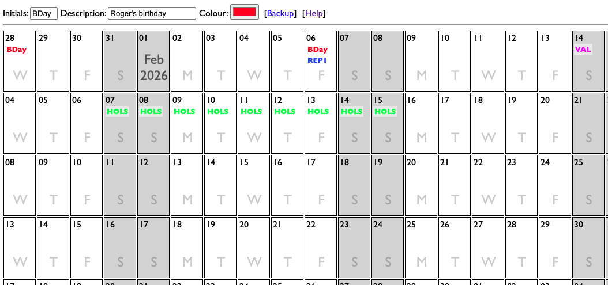

# Ultra Simple Year Planner

This is a VERY simple script that acts as a replacement for that paper year planner that you used to have on the wall of that office that you used to go to.

## Install

Just put the index.php file in a directory on a webserver that runs PHP 8+ and go to that location with your browser.

There is a single variable in the top of the script that stores the number of days from today to display. Default is 400. You could change this if you like.

If you don't have a webserver but you are on a Mac or Linux you can run the ./dev_start.sh script and it will start up the PHP built in webserver for you to use. If you are on Windows get professional help.

## Backup

The script automatically creates a SQLite database called year_planner.db that all your events will be saved in. Events that occured before today are deleted automatically. You can download a copy of the db by clicking on the backup link in the menu bar.

## Use

### Creating
Put short initials in the first box. A description in the second box (short) and pick a colour. Click on __the number__ in day box to add these initials to this day. Repeat for each of the days the event occurs on.

### Deleting
Click on the event initials. The details of the deleted event will be added to the form - which is useful.

### Moving
Click on the event initials. Click on __the number__ in the day you want to add the event to.

### Duplicating
Click on the event initials. Click on __the number__ in that day. This deletes the source event then puts it back but saves the event info in the form. Click the number in the days you want to add the event to.

### Updating
Delete the event. The event info is added to the form. Edit it there. Click the number in the day to add it back in.

### Viewing description
Hover mouse over event for long enough.

### Viewing days in future
Hover mouse over number in day

## Authentication & Authorisation
There isn't any. If you don't want people to mess with it you could add BasicAuth (usually with a .htaccess file). This is a design feature. There was nothing to stop anyone who had access to your office from writing rude things on your year planner either! If you want anything more complex then Google and Microsoft have products ...

